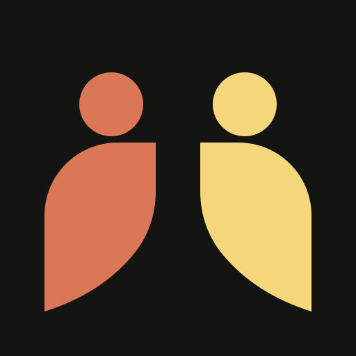

<p align="center">
  
</p>

<h1 align="center">OpenMargam</h1>

<p align="center">
  <strong>Find clarity before making a life-shaping decision.</strong>
</p>

<p align="center">
  A problem-first mentorship network for connecting important questions with
  people who have relevant experience.
</p>

<p align="center">
  <a href="#run-locally-with-docker">Run locally</a> ·
  <a href="#roadmap">Roadmap</a>
</p>

---

<details>
<summary><strong>Why OpenMargam exists</strong> — Read the story behind the project</summary>

<br />

Many people spend years feeling directionless—not because they lack ambition,
but because they cannot see how to connect where they are with where they want
to go.

I know that feeling personally.

When I completed my undergraduate degree, I was deeply uncertain about what to
do next. My parents encouraged me to take the secure job I already had in hand.
I understood why. But I wanted to build a future in AI and robotics.

I could roughly see the destination, yet I could not connect the dots. I did
not know which steps mattered, which risks were reasonable, or how to work
within the constraints I had. What I needed was not another generic article or
search result. I needed someone who understood the path, would listen to the
actual problem, and could help me ask better questions.

Along the way, I also made mistakes—especially financial ones. Taking a loan
that was too large and would take years to repay cost more than money. It cost
time, energy, options, and, most importantly, freedom.

Those experiences are the reason for OpenMargam.

> **The intention is simple:** help people make fewer avoidable mistakes by
> connecting them with people who have relevant lived experience, so they can
> ask important questions and make decisions they will feel proud of when they
> look back.

OpenMargam cannot promise a perfect decision. No mentor can make a decision for
someone else. But timely context, honest questions, and a conversation with the
right person can prevent years of unnecessary confusion or regret.

</details>

## What OpenMargam is building

Most mentorship directories begin with profiles: search a title, scan a list,
and hope the right person appears.

OpenMargam begins with the problem.

1. Describe the decision or constraint you are facing.
2. Match with mentors using expertise, lived context, career stage, language,
   location, availability, meeting format, trust, and budget fit.
3. Understand why each mentor was recommended.
4. Request a conversation without surrendering payment or service ownership to
   the platform.
5. Make the decision yourself, with better context than you had before.

## Project status

OpenMargam is at an **early public checkpoint**, not a finished product.

The active application lives in `web/`. The root `index.html`, `styles.css`,
and `src/app.js` files are the original dependency-free prototype and remain
for reference and regression coverage.

### What works today

- JWT-backed signup, login, logout, and HTTP-only sessions.
- Mentee and mentor roles with server-enforced authorization.
- Mentee onboarding preferences.
- Self-service mentor profile creation and editing.
- Database-backed mentor directory and matching.
- Structured problem intake and deterministic matching v1.
- Ranked recommendations with human-readable explanations.
- Booking requests with explicit states:
  `requested → clarification/accepted → payment pending → confirmed → completed`.
- Role-specific booking actions:
  - mentees request, cancel, and mark external payment as sent;
  - assigned mentors clarify, accept, reject, confirm, and complete;
  - admins remain constrained by the same state machine.
- Mentor-owned payment and meeting instructions with no platform custody;
  OpenMargam holds no funds.
- Safety guidance, report submission, and audit logging.
- PostgreSQL, Prisma migrations, Docker Compose, and curated seed data.
- GitHub Actions checks for tests, typecheck, lint, dependency audit, and build.

### Current limitations

- Curated seed mentors are discovery profiles, not login-ready demo accounts.
- Availability is descriptive text rather than bookable time slots.
- Confirmation emails, reviews, blocking, admin moderation UI, badges,
  communities, and calendar integrations are not implemented.
- Matching weights are code-defined rather than admin-configurable.

## A project intended to stay open

OpenMargam will be developed in public, and its source and roadmap are intended
to remain publicly accessible.

I am building and open-sourcing the foundation, and I intend to host a public
instance for as close to the minimum sustainable cost as possible. The goal is
not to create another platform that extracts a commission from every human
interaction. Mentors should own their services, and communities should be able
to run and improve the software themselves.

I can begin the project, but I do not want its future to depend on one person.
The community should be able to question the design, contribute improvements,
adapt it for local needs, self-host it, and eventually take it further than I
can alone.

## Product principles

- **Problem first.** Start from the decision, not a directory of titles.
- **Human context matters.** Lived experience can reveal constraints that
  generic content misses.
- **The user decides.** Mentors provide context, not authority over someone
  else's life.
- **No platform custody.** No platform wallet, commission, or escrow.
- **Bring your own services.** Mentors choose their payment, meeting, and
  eventually calendar tools.
- **Explain the match.** No unexplained ranking and no mandatory paid AI API.
- **Earn trust honestly.** Trust signals should come from verifiable activity,
  not decorative badges.
- **Stay self-hostable.** Prefer small, understandable infrastructure before
  optional integrations.

## Architecture

- **Web:** Next.js 15 App Router, React, TypeScript, Tailwind CSS
- **Data:** PostgreSQL and Prisma
- **Validation:** Zod
- **Authentication:** signed JWT session in an HTTP-only cookie
- **Deployment:** multi-stage Docker build and Docker Compose

Matching v1 is deterministic, explainable, and runs locally without a paid AI
provider.

## Run locally with Docker

Create a root environment file and set a session secret of at least 32
characters:

```sh
cp .env.example .env
```

Start PostgreSQL, apply migrations, seed curated mentors, and launch the
production-style server:

```sh
./start.sh
```

Open `http://localhost:3000`.

Useful commands:

```sh
docker compose logs -f web
docker compose down
docker compose down -v
```

Do not reuse example secrets or local seed data in a public deployment.

## Run the web app manually

From `web/`:

```sh
cp .env.example .env
npm install
npm run db:migrate
npm run db:seed
npm run dev
```

This path requires a reachable PostgreSQL database matching `DATABASE_URL`.

## Test and validate

Static prototype:

```sh
python3 -m unittest discover -s tests
```

Active web application:

```sh
cd web
npm test
npm run typecheck
npm run lint
npm audit
npm run build
```

## Contributing

Early contributors are welcome—especially people who care about mentorship,
career access, community infrastructure, trust and safety, or self-hosted
software.

Read [`CONTRIBUTING.md`](CONTRIBUTING.md) and
[`CODE_OF_CONDUCT.md`](CODE_OF_CONDUCT.md) before opening a change. Security
issues should follow [`SECURITY.md`](SECURITY.md), not a public issue.

## License

OpenMargam is licensed under the [GNU AGPL v3.0](LICENSE).

## Roadmap

The detailed product plan lives in [`plan.md`](plan.md). The summary below
shows what works, what is in progress, and where community contributions can
help next.

| Phase | Status | Scope |
| --- | --- | --- |
| **0. Public foundation** | Mostly complete | Next.js, TypeScript, PostgreSQL, Prisma migration, Docker Compose, documentation, automated checks, contribution and security policies. Next: add product screenshots. |
| **1. Profiles** | In progress | Auth, mentee preferences, and self-service mentor profiles work. Next: richer mentee profiles, multiple expertise entries, profile links, services, and secure resume upload. |
| **2. Matching v1** | Working baseline | Structured intake, deterministic ranking, filters, explanations, and scenario tests work. Next: persist problem requests, configurable weights, and feedback signals. |
| **3. Booking v1** | Working baseline | Requests, mentor queues, role-specific transitions, and external payment/meeting instructions work. Next: bookable availability, clarification notes, confirmation email, rescheduling, and cancellation policies. |
| **4. Trust and safety** | Early implementation | Reports, risk levels, audit entries, and safety guidance exist. Next: two-sided reviews, blocking, admin moderation, trust rules, and suspicious-link warnings. |
| **5. Badges and community** | Not started | Earned badge rules, public badge pages, follow/save mentor, and small communities. |
| **6. Advanced matching** | Not started | Semantic search, local embeddings, resume extraction, optional AI adapters, and feedback-based ranking. |
| **7. Optional integrations** | Not started | Google/Outlook Calendar, Meet/Zoom, reminders, SMS, and user-provided AI keys. |

### Near-term checkpoints

1. **Prepare the public repository**
   - verify GitHub Actions on the first pull request;
   - add screenshots and a contributor walkthrough;
   - document production deployment, backups, rate limiting, and logs.
2. **Complete the two-sided mentorship flow**
   - expand mentor profiles with services and verification requests;
   - persist richer mentee profiles and problem requests;
   - add availability slots, clarification notes, and email notifications;
   - add individual mentor pages and focused dashboards.
3. **Build the trust layer**
   - add reviews and ratings;
   - add block-user controls;
   - add an audited admin report queue;
   - derive trust signals from real activity.
4. **Grow only after the foundation is trustworthy**
   - badges and small communities;
   - improved and optional semantic matching;
   - calendar, meeting, notification, and AI-provider integrations.

If this intention resonates with you, the roadmap is an invitation: use the
project, question it, improve it, and help shape where it goes next.
